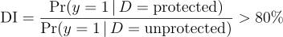

I recently had the opportunity to attend the Big Data & AI World event in London ([post](https://vbr.eus/first-experience-of-speaking-at-a-conference/) about speaking at which you may have already seen in my blog) and wanted to share some of the fascinating ideas that were presented, particularly around data quality and machine learning performance monitoring.

Speaker from [Anomalo](https://www.anomalo.com/) discussed the challenge of scaling data quality monitoring and proposed an innovative approach to automate the process without requiring manual work or hardcoded rules. The approach involved taking the data tables from today and yesterday, applying common transformations to the columns to use them as features, and labeling today’s data as 1 and yesterday’s as 0. The Gradient Boosting Decision Tree (GBDT) classifier was then trained to differentiate between the two datasets. The model’s SHAP values were used to interpret the underlying variables and identify whether today’s data had different patterns than yesterday’s. This approach could potentially be used to monitor data drift in datasets used in machine learning models, automating the discovery of underlying patterns and root causes of performance changes.

Another interesting concept presented was the application of stress testing to data quality-related problems. This involved introducing biases or data quality issues to the data to observe how existing data quality checks were handling it. Although this approach might not be suitable for production, it could be used for offline testing to preemptively monitor changes in the training dataset and avoid overfitting or miscalibration as a result of bugs. This and following concepts have been introduced by speaker from [Giskard](https://www.giskard.ai/), make sure to check their tool and great [knowledge base](https://www.giskard.ai/knowledge-categories/tutorials).

The event also discussed techniques to monitor data drift in machine learning models, including Kullback-Leibler divergence, Population stability index, Chi-square test for categorical features, and Kolmogorov-Smirnov test for numerical features. Additionally, the concept of metamorphic testing was discussed, where input data permutations are used to observe how model predictions change, making it a version of quality assurance in machine learning.

Finally, the event discussed monitoring machine learning models for fairness. A Disparate Impact metric was mentioned, which can estimate the fairness of a model.

Some of the use cases can be:

Identifying fairness issues: The Disparate Impact metric can help identify any fairness issues in the model. For example, if changing socio-demographic features drastically reduces the probability of a positive prediction, data scientists can investigate whether there are underlying biases in the model that need to be addressed.
Improving fairness: Using the results of the sensitivity analysis to identify fairness issues, data scientists can take steps to improve the fairness of the model. For example, they can adjust the model’s algorithm or features to ensure that it does not discriminate against certain groups.

Overall, attending the Big Data & AI World event was an insightful experience, and I look forward to implementing some of these concepts in my work.