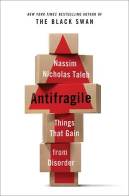
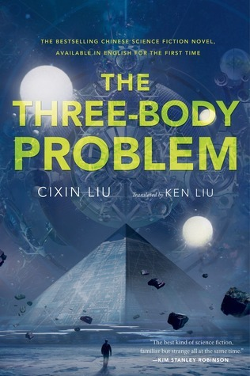

# Books – Longlist

I love reading books. This wasn’t always like that, particularly in the school I loved mostly reading Harry Potter, and maybe some articles of encyclopedia about astronomy. But later things changed; in the university I started reading more various stuff, and particularly helpful was the gift of e-book for one of my birthdays (big thanks to my current wife for that smart gift).

Approximately since then I’ve been tracking, how many books I’ve read, so far I’ve read 295 (data point from 9 Feb 2023). Below I want to list the ones I loved the most, and the ones that influenced me the most. Dividing them by category.

This is living and breathing document and I will update it with other interesting bits as we go.

## Non-fiction

- **Nassim Taleb – Antifragile**

Each person has a favourite author, the one that you keep returning once in a while, have a good connection with a writing style and the ideas. For me it’s Taleb. I started reading his books in the university, where we’ve got suggested “Black Swan” by our professor who was not a super pleasant person but eventually the book recommendation hit the bullseye. I enjoyed Black Swan so much and at the same time I got so disappointed with all the bullshit we’re studying as we were studying Value-At-Risk models which were one of the root causes of 2008 financial crisis. Also I enjoyed “Fooled by randomness”, his earlier book. But then “Antifragile” was announced and I was waiting for it so much!

Back in the day I wasn’t a good reader in English and it was quite hard to order books in English back in Moscow. So I was constantly checking the local websites for the name I thought the book was given in Russian. And the book wasn’t in place for so long I became annoyed. I even ordered an English version in the end, although it was hard for me to read. And then I checked Google Translate and understood that I was translating the name of the book wrong. Checking different version of translation I noticed that the book is in place for quite a while, so I rapidly ordered it and was swamped away by the amount of insights, thoughts and cool examples this book provides. I was re-reading it for, I think, almost the same number of times I re-read Harry Potter; I was gifting it to my boss at the first workplace (who told me that he knows everything about antifragility and don’t need this book and then his company went bankrupt).

This was probably the best book of Taleb. Then he has written “Skin in the game” but in that book he suddenly became a very grouchy unpleasant grandpa (probably under influence of Twitter, a platform that made a lot of people I adored toxic and stupid (or maybe just showed their true identity), Elon Musk being a second example), and the major part of that book was arguing with his critics, speaking up against GMO, and being in general quite stupid, which disappointed me.

But the legacy lives, and to my opinion previous books are the must-read for everyone and will remain classics for a long time.

Other non-fiction books to be added later:

Gleb Arkhangelsky – Time drive

## Fiction

- **The Three-Body Problem**

Wow, what a book that was, what a trilogy. The greatest movie of my life, Interstellar, could be a couple of chapters of that book – so massive and full of ideas it is. I still wait for it to become a series by Netflix or someone of that calibre, to afford the special effects and cast. It just deserves it.

I don’t really know how to write a short summary of that book trilogy, it’s too massive. If you haven’t read it – read it, if you did – you maybe already know what I mean.

More book summaries to follow later, for now including the authors I love:

Terry Pratchett

Strugatsky brothers

Harry Potter

Lord of the Rings

Gabriel Garcia Marques

Andy Weir

and many more. Maybe will do a separate post on shitty books I read (and sometimes thought they are good, including never-ending classic categories of books about successful success, pickup and getting rich).