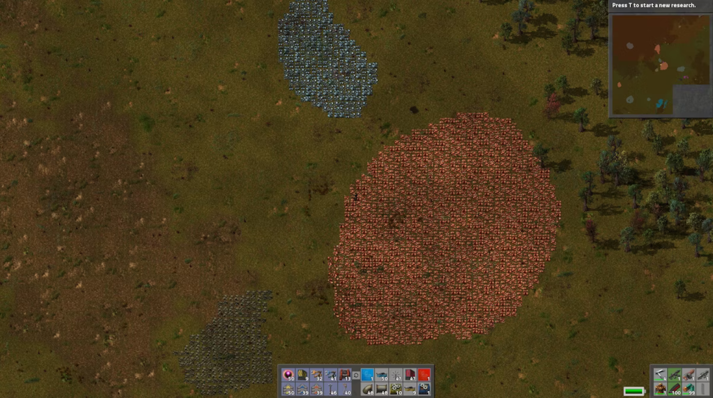
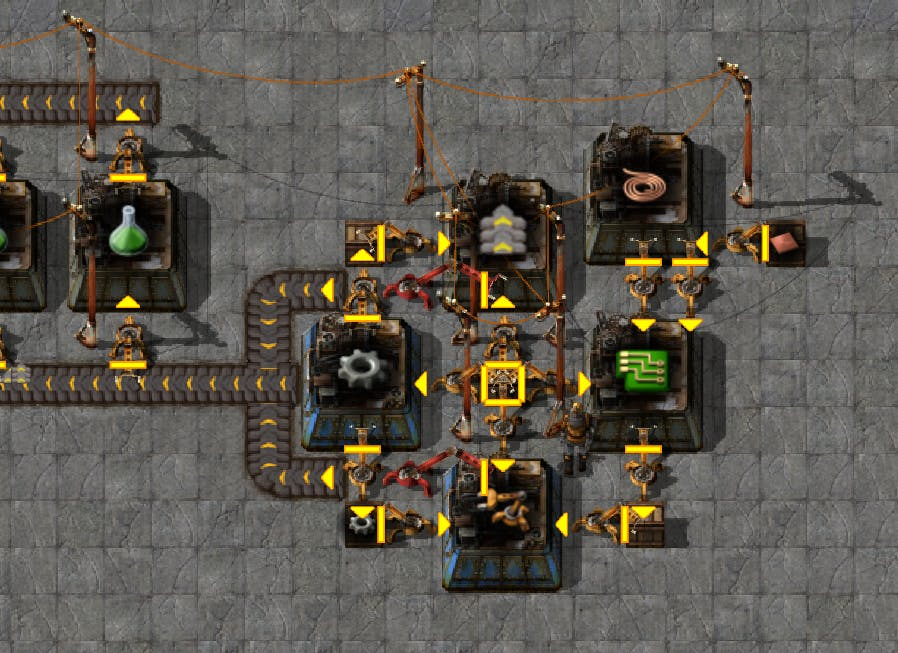
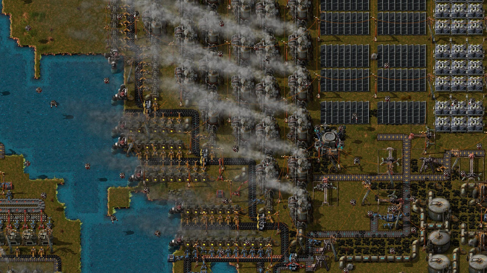
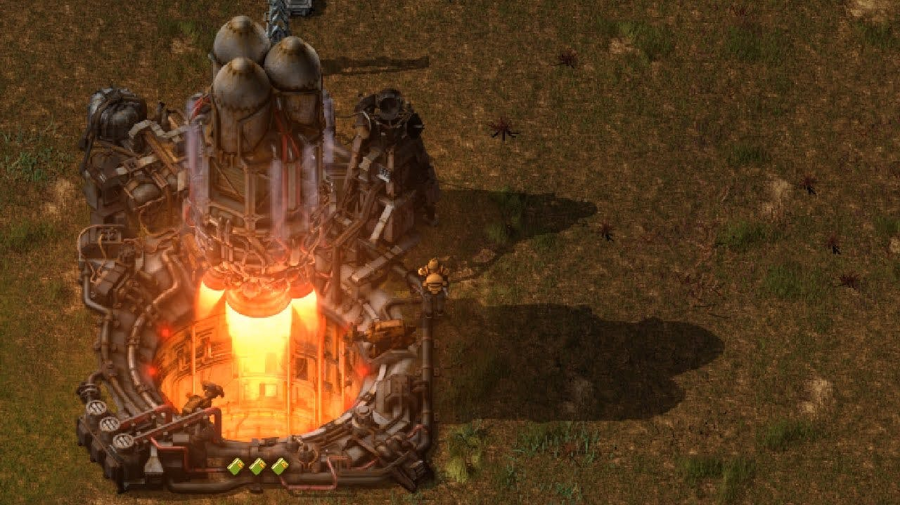

Originally published at [Hackernoon](https://hackernoon.com/from-crashing-to-lift-off-how-to-thrive-as-the-first-data-scientist-in-a-startup)

Recently, while immersed in a game called "Factorio," I noticed striking parallels to the challenges encountered as the pioneer member of a data analytics team in a startup. In "Factorio," the game narrative revolves around an astronaut stranded on an alien planet with only raw materials at his disposal, tasked to build a spaceship for his escape. This scenario felt reminiscent of the real-world process of establishing an analytics team from scratch in a burgeoning startup.

Let's visualize this scenario. You're just appointed the inaugural data and analytics team member in a fresh, promising startup. In your arsenal, you have an innovative product, abundant resources, and a horizon teeming with potential priorities. The questions then arise - where should you begin? What should be your initial thought process? How do you sequentially develop your strategy to construct an effective analytical team from scratch, which would eventually serve as a launchpad for the startup's trajectory? This article aims to delve into these intricate dynamics.

> Disclaimer: While this article draws parallels with the game Factorio, prior knowledge of the game isn't necessary to understand the insights shared; and for those familiar with Factorio, please pardon any oversimplification of the game mechanics for the sake of analogy.

If you've ever wondered what it feels like to crash land on an alien planet with only your raw resources, congratulations – you're in a startup! Remember, a spaceship crash is just a pretty dramatic product pivot.

## Table of Contents
- Phase 1. Manual/foundation
- Phase 2. Initiating automation
- Phase 3. Scaling
- Phase 4. Flight
- Conclusion

As the inaugural member of the data analytics team in a startup, your journey is reminiscent of the first moments in "Factorio." Much like the astronaut, you're venturing into an alien planet, equipped with raw resources and the tools salvaged from your spaceship. These tools symbolize your wealth of knowledge, skills, and experience. Your mission? Transform these primary resources into a functioning rocket ship - a successful, scalable data analytics team.

Well, the previous startup didn't fly as well as expected, so we'll build a new one - with science and automation!

## Phase 1. Manual/foundation

In the initial phase of this mission, you're in exploration mode, much like the astronaut surveying his alien environment. You observe the data landscape, discover data sources (similar to mines of raw materials), and map out potential obstacles. This stage is all about understanding the topography of your new environment. It is a stage marked by high personal involvement, heightened curiosity, and hands-on work.

You begin by manually gathering data from multiple sources, comparable to mining resources from different points in the game. You then create initial reports and analyses to better understand the product and business context. These reports serve as the first bricks in your rocket ship factory, offering valuable insights into your product's performance and customer behavior.

Simultaneously, you forge relationships with various stakeholders in the startup - product managers, software engineers, marketers, and leadership. You communicate your findings, propose data-driven recommendations for product improvements, and even suggest simple A/B tests to validate your hypotheses. Your active involvement in these cross-functional dialogues enhances your understanding of the business and positions data as a crucial component in decision-making processes.

> Being the first data scientist in a startup is a bit like being the first one at the party - you're not quite sure where to put your coat, and you're a bit wary of double-dipping in the guacamole.

However, this exploration and manual operation is challenging. This stage is labor-intensive and demands high levels of personal involvement. Analytics at this stage is manual, like a blacksmith forging tools by hand. Reporting involves connecting directly to data sources, stirring, and shaking data to understand what's happening. An ad-hoc analysis is frequent, which helps to understand unusual instances or random questions.

Your nascent analytics infrastructure may also encounter hiccups that necessitate your manual intervention, sometimes leading to moments of realization about a forgotten piece that isn't working as it should. This stage can feel like a one-person show, where you're running around, juggling various tasks, and ensuring everything operate smoothly.

While this phase may not be flexible or sustainable in the long run, it serves a vital purpose. It equips you with a deep understanding of the data landscape, the intricacies of the product, and the broader business context. You're intimately involved in shaping the foundation of your rocket ship factory, which imparts a rewarding sense of ownership and accomplishment.

However, it's crucial to recognize when to transition from this manual, labor-intensive phase to a more automated, extendable model to avoid stagnation and burnout. This realization marks the end of stage one and the beginning of stage two: initiating automation. It's a vital turning point in your journey, keeping the evolution from a solitary explorer to a strategic architect aiming to build a robust, scalable data analytics team.

*Knowledge about raw resources you have and how to utilise them is crucial at the early stages*

Practical actions you can take at this stage:

- Get to know your data. Understand its sources, the relationships between different types of data, and the overall data architecture in your startup.
- Establish baseline reporting. Start with developing essential reports that provide vital insights into your product or service. These can include user engagement metrics, performance metrics, sales, and revenue metrics, etc.
- Be prepared to perform ad-hoc analyses. These are custom, one-time pieces of research that are done on demand.
- Collaborate with stakeholders. Work closely with your colleagues, particularly those in product management and software engineering. Understand their needs, how they use data, and how you can help them make data-informed decisions.

## Phase 2. Initiating automation

The initial stage's manual labor and high personal involvement serve a crucial purpose – they provide an intimate understanding of the data, business, and product context. This understanding is comparable to a detailed map of the alien planet in "Factorio," highlighting the rich mines of data, potential obstacles, and areas for exploration. However, a shift towards automation is necessary to ensure scalability and efficiency.

As you transition into this phase, your role morphs from a hands-on miner to an architect. You begin to design processes that optimize the transformation of raw data into valuable insights, like setting up machines to automate the mining and refining of resources in the game.

One of your primary tasks in this phase involves identifying bottlenecks in your processes – repeated frequently, essential for smooth operation, consuming a significant amount of your time, and, most importantly, can be automated. In the game of Factorio, it's akin to finding out which parts of the resource processing can be automated to free up time and boost efficiency.

These tasks could range from ad-hoc analyses required for primary product metrics reporting, studies essential for A/B tests (such as power analysis for the new test and post-test analysis of the A/B test metrics), or even routine data gathering, joining, and transformation to answer recurring business questions.

> When setting up your initial data infrastructure, you'll often encounter a piece of code that no one dares to touch. It's like the support beam in a crumbling building - we don't know why it's holding everything up, but we're not about to pull it out to find out.

As you identify these tasks, you adopt some of three primary strategies to streamline your workflow:

- ** Building a factory** : In "Factorio," a factory is an assembly line of automated machinery that takes in raw materials and churns out finished goods. In the world of data analytics, a 'factory' is a suite of tools and systems designed to automate your workflow. These may include workflow schedulers like Airflow, which automate regular tasks, dashboard systems such as Redash or Grafana, which automate reporting and foster a self-service environment for stakeholders; and ETL/ELT pipelines which automate data transportation and transformation.

-  **Expanding your team** : This is similar to inviting friends for a cooperative game in Factorio. Expanding your team involves hiring more data specialists. They bring diverse skill sets and perspectives, which accelerates progress and helps build robust analytics capabilities.

- **Developing a technology tree**: In Factorio, a technology tree represents all the possible upgrades and technological advancements. Similarly, in a startup, it refers to planning and implementing the necessary technology stack that supports your data needs, ensuring the scalable, long-term growth of your analytics operations.

However, it's essential to maintain a balance during this phase. While it may be tempting to automate every process and hire extensively, ensuring these decisions align with the startup's financial resources and strategic goals is critical. Additionally, remember to design flexible systems that can adapt to evolving business needs – avoid creating a complicated, high-maintenance infrastructure that could become a burden in the future.

The transition from stage one to stage two reminds me of evolving from an explorer to an architect in Factorio. It marks a significant shift in how you interact with data and sets the stage for your analytics team's scalable, efficient growth. The journey is far from over, and there are still stages to navigate, but the groundwork you've laid here will be instrumental in the coming stages.

> Early automation, even simple and not very scalable, can help you get rid of manual and repetitive work

Practical actions you can take at this stage:

- Look for tools that can help you automate your routine tasks. This could include data cleaning tools, reporting software, dashboarding tools, etc.

- Identify tasks you perform frequently and look for ways to automate them. It can save you considerable time and increase efficiency.

- Start developing your data infrastructure. It involves setting up data pipelines, implementing a data warehouse, and setting up ETL processes.

- As you move to this stage, you may need to expand your team. Look for individuals with skills that complement your own and can help you scale your operations.

## Phase 3. Scaling

In the previous stages, you've laid the foundation and initiated automation for your analytics operations, much like building a rudimentary factory on an alien planet in "Factorio." Now comes the time to scale, expand your operations, and prepare for growing demands. This phase is similar to increasing your factory, optimizing production lines, and preparing for larger, more complex challenges in the game.

At this juncture, your analytics system is mainly automated, doing much of the routine work without your constant involvement. The system has morphed from a basic rocket ship factory into a more sophisticated operation. Yet, this is not the moment to rest but to gear up for more significant challenges. It's similar to the game scenario where resources become scarcer and demand multiplies - it calls for a strategic expansion.

The scaling phase has three crucial components:

- **External resource integration**: In "Factorio," as you exhaust local resources, you must build train networks to import materials from distant mines. Similarly, as your internal data resources need to be improved to drive deeper insights in a startup scenario, you might need to integrate third-party data or expertise. This could mean adopting external data APIs, forging partnerships for data sharing, or hiring external consultants or agencies with niche skills.

- **Monitoring**: Much like setting up dashboards to monitor your factory's efficiency in Factorio, it is crucial to establish robust performance tracking in a data analytics setup. Regularly monitoring your analytics system's performance, peak capacity, and identification of bottlenecks ensure its smooth operation. It also provides insights for future improvements and helps in proactive troubleshooting.

- **Refactoring**: In "Factorio," you often have to restructure your factory to accommodate new technologies or to make the production line more efficient. Similarly, in a data environment, refactoring or re-engineering your data pipelines, models, or reports might be necessary to improve efficiency, reduce computational costs, or incorporate changes in the business context.

Throughout this stage, the critical emphasis is on efficiency and optimization. While aiming for massive growth is tempting, the scale phase is more about 'smart' growth. It's about ensuring that your operations are extendable, maintainable, and flexible enough to adapt to the rapid changes characteristic of startup environments.

> Scaling up your processes is a bit like building your IKEA furniture - you start off with manual labor, realize you need some automation (or at least a power drill), and eventually, you’re standing back admiring your work, just to realize you’ve got some leftover parts. Did we really need that data pipeline, or was it just an optional extra?

Scaling also includes planning for future growth. While you want to ensure that your current setup is efficient, you also want to anticipate the needs of your growing organization. This might mean investing in scalable technologies, planning for increased data storage and processing capabilities, or even initiating discussions about building a data warehouse.

Much like the game "Factorio," the challenges are becoming more complex and demanding, but the opportunities for creativity and impact are also growing. As you navigate this stage, your role evolves from an architect to a city planner, meticulously planning and overseeing the growth and development of your analytics operations. And as you do so, you lay the groundwork for the final stage - the flight.

*our factory may look very complicated at this stage; so the subject matter knowledge, monitoring and refactoring are crucial!*

Practical actions you can take at this stage

- Implement tools and processes to monitor the performance of your data infrastructure. Identify bottlenecks and areas for improvement.

- Continually look for ways to optimize your processes and data infrastructure.

- As your operations grow, you may find that specific processes or systems no longer meet your needs. Be prepared to refactor or redesign these as necessary.

- You may need to start integrating external data sources or systems. Establish new data pipelines or expand your data infrastructure.

## Phase 4. Flight

Much like in "Factorio," where the ultimate goal is to build a rocket and escape the alien planet, in the context of a startup's analytics team, the 'flight' phase represents reaching a stage where your analytics operations are fully-functional, robust, flexible, and are driving strategic decisions and value creation.

At this juncture, you're not just managing a data analytics operation; you're overseeing a well-oiled machine contributing significantly to the startup's trajectory. You have built a system that functions almost independently, only requiring your attention for high-level strategic decisions and occasional troubleshooting.

However, just as in the game, reaching the final stage doesn't mean you're free from challenges. Even at this level, there are hurdles to overcome:

- **Evolving competition**: In "Factorio," the aliens evolve and become more of a threat as you progress. Similarly, competitors will continue to grow and innovate in a startup environment. You must ensure that your analytical capabilities continue to develop, staying ahead of the curve and providing the strategic edge your startup needs to thrive.

- **Resource constraints**: Time is a critical resource, especially for startups. Despite having a successful operation, you may need more help. It's essential to ensure that your analytics operation runs efficiently and that resources are allocated strategically to support continual growth and innovation.

- **Decreasing marginal utility**: Over time, some of your data processes and models may lose effectiveness or become outdated. Just as you would upgrade your factories and technologies in "Factorio," it's essential to regularly revisit and improve your analytics operations. Keeping your analytics tools and techniques up-to-date ensures you continue generating valuable insights.

Therefore, the 'flight' phase is not about coasting but continual improvement, adaptation, and innovation. It's about maintaining the momentum built up and pushing for greater heights.

> First launch is a moment to celebrate, but for a data scientist the game doesn't end here - it may be just a beginning!

Practical actions you can take at this stage

- Don't rest on your laurels. Continually look for ways to improve your operations, whether through new tools, processes, or data analysis approaches.

- Keep up with developments in the field of data science. This might involve learning new tools or techniques, attending conferences, or reading relevant publications.

- You should contribute to your startup's strategic decisions at this stage. Use your data insights to inform these decisions and drive growth.

- Be mindful of your resources. Ensure that you are allocating your time, your team's time, and your budget to maximize return on investment.

## Conclusion

Establishing and growing an analytics team in a 0 → 1 startup environment can be an exciting, challenging, and rewarding journey - much like progressing through the stages of the game. Starting from basic manual work, you gradually build your operations, initiate automation, scale your capabilities, and finally reach the flight stage, where your analytics operations become vital to your startup's journey.

However, each step requires different skills, strategies, and perspectives. Like in the game, you need to continually adapt, innovate, and strategize to ensure the success of your analytics operations and, consequently, your startup. By understanding and implementing this four-stage approach, you can survive and thrive in a 0 → 1 analytics team.