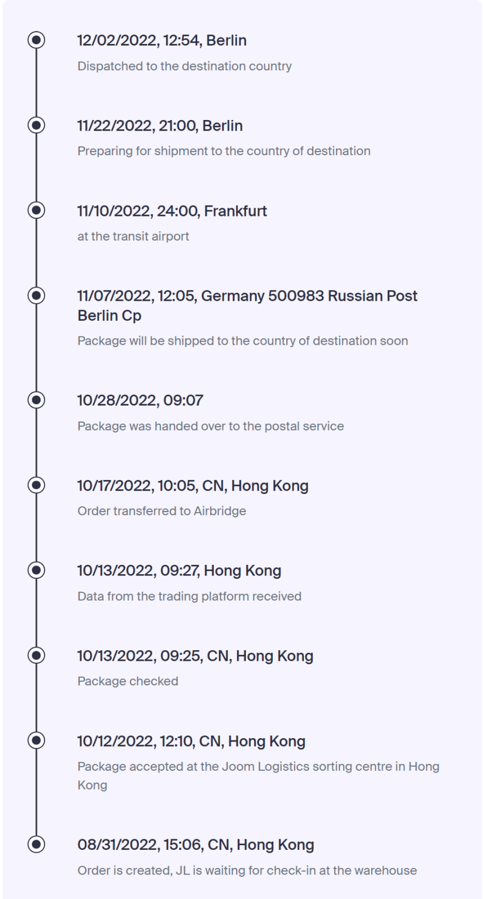

Just received my Flipper Zero yesterday, wow, what a journey that’s been!

In 2020 during the summer it was short out of Covid lockdowns in Russia but everyone was still working from home so I decided to both visit my hometown to have the time off and to spend some time working from there. It was super hot summer in Russsia, like +40 degrees celsius in the shadow, so it’s hot even just to simply lay in the shadow, the only thing that can save you is either air conditioner or pool which we luckily have on my parents cottage house.

So during this interesting and hot period of time one day I was hiding from the heat at home and stumbled upon the article saying about the project “Flipper Zero” on Kickstarter. The guys wanted to make a “Tamagochi for hackers” (see website for more detailed descriptions but in general the device would give you ability to program various remotes / RFID / NFC cards into it for various purposes and have one device instead of million various cards/keys/remotes/etc). They aimed to collect $50k and they ended up collecting overwhelming $1.5+ million!

Having so much money they aimed for a solid production process to make everything “like big guys”. That obviously required time. Then container crisis happened, also microchip shortage happened (along with multiple continuing lockdowns in Europe and China) which delayed shipments for quite a while.

Just about the time I had to relocate to London I got an email that I need to decide my delivery address since it would be locked soon. The trick was – I had no idea which would be my UK address (haven’t even known my office address). So I agreed with my friend to input his address in Moscow so that I can collect the Flipper from him later.

That was a good plan, but then the war in Ukraine happened, and sanctions made shipping of all the parcels and especially electronic components to Russia quite tricky. Finally I got my tracking number in August 2022 (almost precisely 2 years after I initially backed the project). But that wasn’t the end of story. I was monitoring the tracking, waiting for it to moved, and it’s been moving.

But then for some reason it got stuck in Berlin. I was thinking – maybe no big deal, just waiting for the batch to arrive to send it all to Russia. Until, one day later I read the news, and understand that
How many interesting stories ended and how I expected mine to end

Basically German customs, due to sanctions, decided to block the delivery and destroy the batch of Flippers worh 200k euro. I was thinking – okay, here’s the end to this glorious story.

But it wasn’t the end. Thanks to the kind people at Flipper, they offered to send the replacement, for which I was able to state my UK address. And I got it basically yesterday.

There is a Russian proverb – “You wait for the promised thing for three years”. It was almost my case, but I’m really happy that I finally got it.

So, what’s inside? So far I’ve been playing with some of the basic features; the ones I tested and enjoyed so far are:

- Changing channels in the local gym via the universal remote;
- Opening / closing Tesla charging hatches – the signal is unencrypted and you can download it from various websites;
- Using the Pomodoro timer app to try and be slightly more productive;
- Playing Snake;
- Playing some 8-bit ringtones from movies;
- Reading bank NFC cards (for some reason it read Monzo / Revolut, but haven’t got luck with Barclays / Amex);
- Using it as a bluetooth remote for the projector.

I suppose there is much more to come, still just playing around with it. There are tons of potential features I’m looking forward to trying, specifically:

- Animal microchip scanner. I often notice some cats / docs wandering around and I’m not sure whether the pet is lost or just walking by itself (which is more rare thing in UK than in Russia, but happens sometimes). Probably this feature could help locate potentially lost pets.
- Metronome for playing piano;
- Battle City game;
- Wi-fi and other sensors;
- Potentially using Flipper in connection with some PC software to make the robot vacuum cleaner “smarter”.

Still lots of things to learn about this device, but really appreciate the ton of efforts the team has put into it and looking forward to updates. Big shout out to those who contributed to its success despite the difficulties! I know there’ve been million of nagging comments (which is normal when you have clients from Russia where people are nagging for every possible reason). I think the team definitely deserved the kind words.