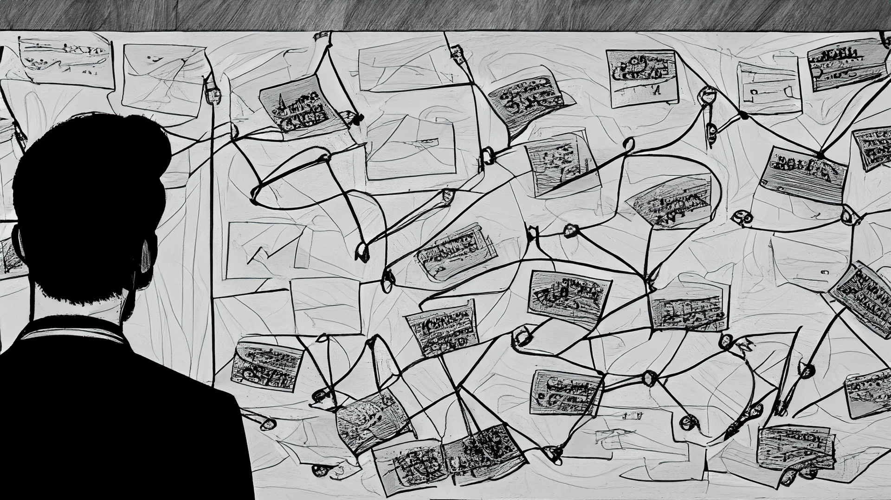

Time flies fast, and I absolutely forgot to tell you about one of the quests I managed to complete last year - obtaining a UK Global Talent Visa! Maybe it will be useful for someone planning to apply, but for me, it's more of a reflection on how it went. To be honest, it was a bit of a crazy year, and the process was a long emotional rollercoaster with its twists and turns. So, I'm really happy it all worked out in the end. Pour yourself some tea, join me for a journey, and let's roll.

Brief disclaimer - this article describes my experience of obtaining the Global Talent visa as it was in mid-2023. Given the constantly changing requirements and the not fully transparent logic of approving or declining applications, I think the best way to stay up-to-date is by checking out the endorsement organization's website or forums/telegram chats on the topic, or paying for a consultation with a specialist who knows all the latest changes (worth its money, from my perspective, as this was the path I took - more on that later).

## TL;DR and some pieces of advice.
Maybe you're not very interested in my experience, but want some advice - I won't waste your time. Here are some takeaways you can use:

- If you're planning to apply for a GT visa but are not in a rush - consider building your public profile. Don't deprioritize it because work-related things alone won't earn you the talent visa. Apply for conferences, mentorship programs, and write articles for Medium, Hackernoon, your blog, or other relevant platforms.
- If you're applying soon - consider hiring a consultant. I wouldn't advise working with bigger companies like Immigram and others because the reviews about them are mixed, with quite a lot of negative feedback. They really work at scale and sometimes it can take a long time to apply with them. I worked with [Nadia Zhuk](https://beetlehope.com/), who received the Talent visa herself and provides flexible plans of collaboration tailored for different use cases and application timelines. Highly recommended.
- Don't expect your consultant to do all the job for you. Only you know your achievements best, and you need to think about how to present them best. The consultant can help you choose among them and adjust your tone to the expectations, but the main responsibility is on you.
- Be prepared to spend a lot of time preparing high-quality documents. It's a demanding process, so if you can - take time off work. It's really hard to work and prepare documents simultaneously. Be prepared to spend 3-6 months on your application.
- Don't rely on ChatGPT for preparing your documents. While it can be a helpful tool to proofread your text and correct minor grammar mistakes, the content it produces is too vague, and its usage is forbidden by the TechNation guide - you can get a rejection for using it.
- The [TechNation guide](https://stagetechn.wpengine.com/visa-tech-nation-visa-guide/) is your friend - there are a lot of details in the guide, but it has a comprehensive list of things you need to include.
- Pay attention to formatting - e.g., at first, there were no phone numbers in my LoRs, but you need to add them as it's in the guide. There are also a bunch of things that have to be mentioned in LoRs - tell your peers to include them as well.
- If you get an initial rejection of your application - don't be discouraged. Take some fresh air, then think it through - the reviewers are human and sometimes they also make mistakes. If there are clear items mentioned in your documents that can help you appeal to most of the rejection reasons listed - try appealing. If not - don't waste your time, try to improve what's possible, and apply a bit later.

Hope my experience will be useful to you if you're considering applying - wishing you the best of luck!

## Part 1. How it all began.

Looking back a couple of years from now, I wasn't actively planning to apply for a global talent visa. Like many others, I didn't even know about the existence of such a visa in the UK until I heard about it from one of my former coworkers. It sounded nice - unlike the Skilled Worker visa, which I was on, the Global Talent visa would allow me to be independent from my current employer. For the Skilled Worker visa, your employer needs to pay for a "Certificate of Sponsorship" for you, and not many companies do that. In my mind, the visa was something not very realistic for me to receive, as I thought I didn't have a huge public profile with commits to open-source repositories, published articles, and speaking at conferences. I was always mostly focused on getting the work done and hadn't spent much time working on my profile. It turned out that's not the optimal strategy. It seemed that to be recognized as an Exceptional Talent (what a fancy name!), you have to be some sort of superhuman who has all the energy in the world to not only work full-time but also dedicate a lot of spare time to all the profile-building activities.

So, the idea of trying to obtain the visa was planted in my head, in the best Inception manner. But being a busy and somewhat lazy person, I wasn't actively moving towards its direction. However, I started to consider it, thinking about improving my public profile a bit, and then try applying.

Then, after some time, interesting things started happening in the IT market - all of a sudden, big and successful companies began to seem less successful with stocks falling, hiring freezes, cost-cutting initiatives, and layoffs following. The environment, which seemed safe and predictable previously, became hostile and competitive. The job market started to become less hungry for specialists, and the chances of getting a new job in case of losing the current one began to look a bit more bleak. All that feeling of discomfort and uncertainty revived the thoughts about the Global Talent visa. At first, at the end of 2022, it didn't get me far, but when the new layoffs were announced, I decided it was time to act more decisively.

## Part 2. First steps.

First of all, I had no idea what the requirements were and how to approach the whole application process. Luckily, my wife had previously saved the contact of a visa consultant recommended in one of the Russian-speaking telegram chats, so I could consult with her to obtain a much more detailed picture of what to expect. Initially, my main goal was to just understand whether I had any chance at all to obtain that visa. From my humble perspective, the chances weren't great. So, I took a consultation and discussed my background, what requirements there were, and what I had on hand to include in my application.

It turned out, my initial impression of the importance of public profile wasn't entirely correct, as there are different criteria you can choose to prove your talent. Public profile is only one of them (although elements of a public profile are generally important and need to be included in your application). There are four criteria, and you need to pick two out of them:

- Working on some innovative product as a founder or employee (I initially missed the part that you could be an employee, not just a fancy CEO);
- Public profile and open source contributions (work beyond the main occupation);
- Significant technical, commercial, or entrepreneurial contributions to the field while working in an IT company;
- Academic contributions (like published scientific papers, etc.)

Many people pick the third one as it's quite straightforward for those working in senior positions in IT companies. The second criterion that made more sense to me was the innovation one, as I had worked on innovative products and was heavily involved in the development of some core features. So after the consultation, it seemed worth trying to apply, as the chances weren't low and it seemed like a worthy investment of time and money. I also realized that figuring out all the complexities of the requirements on my own was quite unlikely, so I decided to proceed with the help of [Nadia Zhuk](https://beetlehope.com/) and purchased the strategy session and review package from her, which seemed like the most cost-effective option.

## Part 3. The quest.

It was March in the UK, the trees were turning greener, the weather was less miserable, and the birds chirped, sensing spring's arrival. Meanwhile, I was in a hectic state, pondering how I would manage the application. Adding more spice to my application process were two factors: 1) layoffs at Meta were expected in two months, and 2) TechNation (the endorsement organization for IT specialists) was hinting they might cease operations. With time as a scarce resource, it was clear that acting fast was crucial. Thus, the gears started spinning, and my quest began.

The first thing that seemed time-consuming was obtaining Letters of Recommendation from various colleagues. I reached out to them and also purchased a DocuSign subscription to manage signatures more easily (it provides trustworthy evidence of signing, which wasn’t a strict requirement but a good-to-have). Additionally, I got a Grammarly subscription to double-check my grammar in the documents.

The experience was quite nostalgic, as I recalled the projects I worked on over the last five years and my achievements. I reached out to former coworkers, some of whom I hadn’t spoken to in a while. At one point, I also needed screenshots of commits/tasks I worked on to prove my involvement and impact. Thankfully, this was possible, which added to the nostalgia.

The writing process was long and tiring. I took time off work to write, spending a long bank holiday weekend writing from morning till evening. My wife helped check the documents, and Nadia provided invaluable feedback on adjustments and highlights. Finally, after days of writing, checking, and rewriting, the documents were ready to submit. We had a review call with Nadia to discuss the final adjustments. Then, on April 12th, Russia's Day of Cosmonautics, I submitted my application, thinking it was the best date to do so.

## Part 4. Waiting and failure.

Then the long waiting process began. It was a time when many people applied due to layoffs in the tech industry and the anticipated closure of TechNation. The situation was unclear, and I braced myself for a potentially long wait, maybe up to four weeks. I constantly checked the application. In the chats, it was mentioned that an "Edited" date is displayed, which changes when someone reviews your application or performs any backend process within TechNation. This became a source of constant anxiety for applicants. I was diligently checking, but the date seemed unchanged. Then I realized the date was actually changing; I had just been looking in the wrong place. So, I found myself checking that page 5-10 times a day, the only thing changing (yes, the process isn’t really transparent), hoping for some results. It was said that it takes about 3-5 edits to make a decision. Some lucky folks could get approved just a few days after applying. That wasn’t my case. After 2, 3, 4, 5, 6 edits, the constant checking and anxiety continued. There was talk that more than 6 edits likely meant a rejection. I hoped that wasn’t my case, but it was.

One day, I received an email stating that my application had been reviewed. I rushed to log in and see the results. It was a rejection. The reasons provided were a bit strange - some related to information that was in the documents. It seemed like the reviewers might have missed something or misunderstood the references. I discussed this with Nadia, and she shared the same impression. So, I decided to appeal, doing it myself since it involved only four paragraphs of text. I spent the weekend drafting the appeal and submitted it.

Later, in the chats, I saw that there were many rejections during this period. Perhaps the increase in applications had raised the bar for the reviewers, or maybe they were tired and burned out from the increased workload and uncertainty. I don’t know. But that was the fact.

Frankly speaking, I wasn’t expecting the appeal to be successful. I felt quite sad and demotivated because it seemed everyone around me was succeeding, and I was failing, as this rejection seemed to invalidate all the achievements I thought were so cool and impactful. However, with the job market still uncertain and uncomfortable, I decided to further work on my application, enhance my public profile, and do more mentoring. I began planning how to spend the next 3-4 months with the highest return on investment in terms of career capital to reapply later (while my Letters of Recommendation would still be valid). I wasn’t expecting the appeal to succeed, but Lady Fortune had different plans for me.

## Part 5. The unexpected success.

One evening, as I sat behind my PC, I received a very bureaucratic email updating the status of my appeal. On a quick scan, my eyes caught the words "something something... rejected", and I thought, "Well, this is it." However, upon reading it more carefully, I realized it actually suggested that my appeal was successful. The language was so unclear that it took me three tries to comprehend its true meaning. When I finally understood, I called my wife over, and she, too, read the letter multiple times as I began dancing with joy. It was unexpectedly encouraging news, reigniting my belief in myself. It felt like a huge weight had been lifted off my shoulders, one of the happiest pieces of news I'd received in years.

The following months were filled with celebrations and the necessary bureaucratic procedures, like updating my Biometric Residence Permit (BRP). It's somewhat annoying that you don’t receive any diploma or even a simple congratulatory email after getting your endorsement. The only proof is "Global Talent" written on your BRP, which will eventually be replaced upon obtaining Indefinite Leave to Remain (ILR). It's a shame, really. I've thought about starting a business to provide fancier acknowledgments, like plates carved in stone or metal, to properly reflect the life-changing impact of this visa.

Nevertheless, this was my journey, and I was thrilled to have finally obtained the visa. My wife and consultant shared in my happiness. Later, I participated in an interview on Nadia’s channel, where I shared more details about my application process. Feel free to check it out if you're curious. [Youtube video interview with more details of my application](https://youtube.com/watch?v=PcGUd1wrcck)
