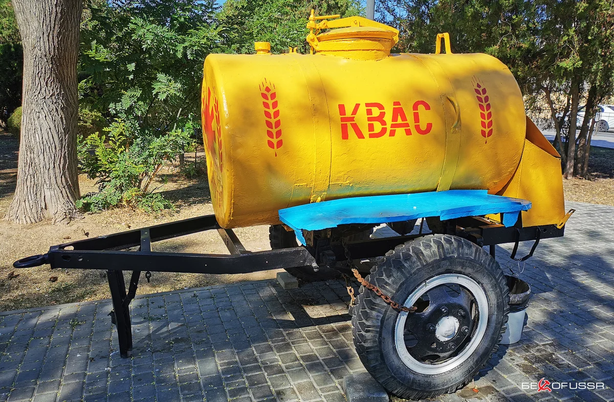
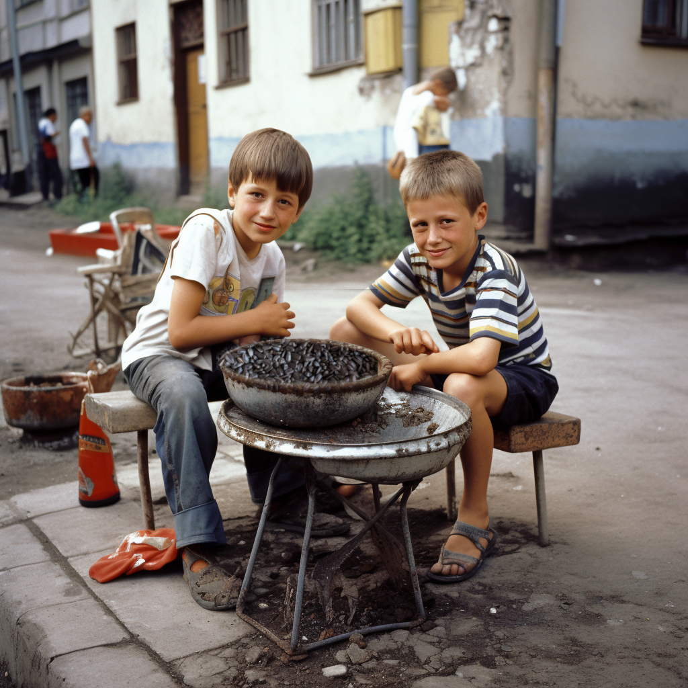

In the world of success stories, we often find narratives filled with inspiration, detailing the challenges and obstacles individuals overcome on their path to triumph. I have a tale to tell, but it isn’t quite that. It’s a story steeped in innocence, humor, and the spirit of entrepreneurship, set against the backdrop of an idyllic summer in Orenburg, Russia.

Years ago, when life seemed a little more colorful, my friend and I found ourselves indulging in the quintessential summer pastime – doing absolutely nothing. However, my friend’s restless spirit meant he couldn’t idle for long. He was a veritable fountain of ideas, some whimsical, others peculiar, but all invariably adding a dash of excitement to our lives. One such brainwave led to our first business venture – selling fried sunflower seeds, a beloved snack in Russia.

Our business model was straightforward. We’d purchase fresh sunflower seeds from the local market, fry them at home, and pocket the profit, envisioning it to fund our little pleasures – ice cream, soda water, crisps, or time at the local computer club. So, one morning, armed with our entrepreneurial spirit, we journeyed to the town market. We invested all but a small portion of our money in a polyethylene bag brimming with sunflower seeds.

The market was a 20-minute bus ride and a 45-minute walk from home, but serendipity led us to a large barrel of kvass, a popular Russian refreshment. The idea of a cold drink on a hot day was too tempting, and we unanimously decided to reallocate our transport funds to instant gratification. The kvass was divine, leaving us invigorated and ready for the challenges ahead. We attempted a free ride home but were promptly ejected by an unsympathetic conductor.

With no other option, we decided to walk home. Our bag, cheap and flimsy, began to tear, threatening to spill our precious cargo. Thanks to the occasional drinking water pumps scattered around our town’s old houses sector, we managed to quench our thirst during the sweltering walk home.

Once home, we endured another setback as we accidentally spilled some seeds while entering my friend’s house. Undeterred, we proceeded to the kitchen with our diminished stock. Lacking internet access, we trusted our instincts and cooked the seeds in butter. It took the smell of burning to make us realize that dry toasting was probably the better approach. The taste test confirmed our suspicion – our sunflower seeds were ruined.

Despite our misstep, we clung to hope. We found a few seeds that weren’t entirely burnt and decided to mix them in with the rest. With our product ready, we set out to sell our sunflower seeds to the good people of Orenburg. We managed to make one sale, to a local ice cream seller, but she soon returned, asking for a refund.

Our venture, we concluded, was unsuccessful. We didn’t attempt to sell sunflower seeds again, and at the tender age of ten, I didn’t draw any profound lessons from the experience. Nevertheless, it was an entertaining way to spend a summer day, and I now look back on it with fondness and warmth.